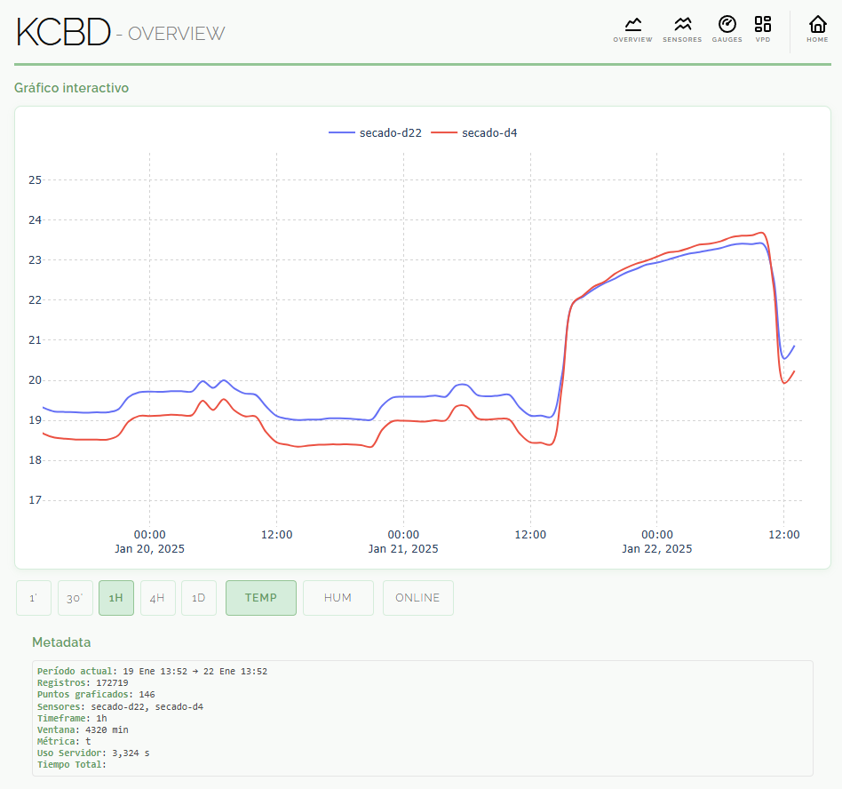

# dj-indoor-monitor



Sistema de monitoreo de sensores para cultivos indoor mediante dispositivos Raspberry Pi.

## 1. Sobre el sistema

Backend para procesamiento y exposición de datos de sensores ambientales. Sirve un sitio web con gráficos interactivos, estadísticas en tiempo real y una *API REST* para integración con otros sistemas (Power BI, Grafana, etc.). Los datos se procesan mediante pandas para ofrecer agregaciones temporales (timeframe) optimizadas, con un payload muy eficiente y metadata, permitiendo tanto monitoreo básico como análisis detallado.

Actualmente el sistema se encuentra en producción implementado por KCBD (empresa de Grupo ALVS) y puede visitarse en https://kcbd.grupoalvs.com

### Tecnologías Empleadas
- **Framework**: Django, DRF
- **Visualización**: HTMX, Plotly
- **Base de Datos**: PostgreSQL, TimescaleDB
- **Infraestructura**: Docker, Gunicorn, Nginx
- **Testing**: Pytest

## 2. Funcionamiento

### Arquitectura
Infraestructura basada en contenedores:
- **webapp**: Django + Gunicorn
- **db**: TimescaleDB (PostgreSQL)
- **nginx**: Reverse proxy
Esta misma infraestructura funciona en entorno local, usando el mismo docker db (`python manage.py runserver`)

### Flujo de Datos
1. Sensores -> API
2. Almacenamiento -> TimescaleDB (PostreSQL)
3. Visualización -> Frontend (HTMX + Plotly)

## 3. API

La API está basada en Django REST Framework y expone los siguientes endpoints:

### 3.1 Sensor Data API (Legacy)

Base endpoint para operaciones CRUD estándar:
```bash
/api/sensor-data/
```

Últimas lecturas por sensor:
```bash
/api/sensor-data/latest/
```

Datos agregados por intervalos:
```bash
/api/sensor-data/timeframed/
/timeframed/ #shortcut
```

### Operaciones CRUD

```bash
GET /api/sensor-data/
```
```json
{
    "results": [{"timestamp": "2024-01-15T14:30:00Z", "sensor": "rpi-001", "t": 24.5, "h": 65.3}],
    "count": 1
}
```

```bash
POST /api/sensor-data/
{"sensor": "rpi-001", "t": 24.5, "h": 65.3}
```

### Agregación Temporal

El endpoint `/timeframed/` implementa agregaciones. Por ejemplo para obtener los datos agrupados cada 30 minutos, desde 2025:

```bash
GET /api/sensor-data/timeframed/?timeframe=30T&start_date=2025-01-01
```

> **Nota**: Los timeframes se especifican utilizando un número seguido de una unidad de tiempo. Por ejemplo, `30T` se refiere a 30 minutos, `1h` a 1 hora, `4h` a 4 horas, y `1D` a 1 día.

Parámetros:
- `timeframe`: Intervalo de agregación [5s|1T|30T|1h|4h|1D]
- `window_minutes`: Ventana temporal en minutos
- `sensor`: ID del sensor (opcional)
- `metric`: Métrica específica [t|h] (opcional)
- `metadata`: Incluir metadatos [true|false]

Respuesta:
```json
{
    "results": [{
        "timestamp": "2024-01-15T14:30:00Z",
        "sensor": "rpi-001",
        "temperature": {"mean": 24.5, "min": 23.1, "max": 25.8, "count": 12},
        "humidity": {"mean": 65.3, "min": 62.1, "max": 68.4}
    }],
    "metadata": {
        "timeframe": "30T",
        "groups": 48,
        "query_duration_s": 0.145
    }
}
```

### Optimización

La implementación utiliza:
- Operaciones vectorizadas de Pandas
- Manejo nativo de timestamps
- Agregaciones multi-nivel por sensor/tiempo
- Chunks para optimización de memoria

Timeframes recomendados según uso:
- Monitoreo: 5s - 1T
- Visualización: 30T - 1h
- Análisis: 4h - 1D

### 3.2 Data-Point API

Base endpoint para operaciones CRUD estándar:
```bash
/api/data-point/
```

Últimas lecturas por sensor:
```bash
/api/data-point/latest/
```

Datos agregados por intervalos:
```bash
/api/data-point/timeframed/
/timeframed/ #shortcut
```

### Operaciones CRUD

```bash
GET /api/data-point/
```
```json
{
    "results": [{"timestamp": "2024-01-15T14:30:00Z", "sensor": "rpi-001", "t": 24.5, "h": 65.3}],
    "count": 1
}
```

```bash
POST /api/data-point/
{"sensor": "rpi-001", "t": 24.5, "h": 65.3}
```

### Agregación Temporal

El endpoint `/timeframed/` implementa agregaciones. Por ejemplo para obtener los datos agrupados cada 30 minutos, desde 2025:

```bash
GET /api/data-point/timeframed/?timeframe=30T&start_date=2025-01-01
```

> **Nota**: Los timeframes se especifican utilizando un número seguido de una unidad de tiempo. Por ejemplo, `30T` se refiere a 30 minutos, `1h` a 1 hora, `4h` a 4 horas, y `1D` a 1 día.

Parámetros:
- `timeframe`: Intervalo de agregación [5s|1T|30T|1h|4h|1D]
- `window_minutes`: Ventana temporal en minutos
- `sensor`: ID del sensor (opcional)
- `metric`: Métrica específica [t|h] (opcional)
- `metadata`: Incluir metadatos [true|false]

Respuesta:
```json
{
    "results": [{
        "timestamp": "2024-01-15T14:30:00Z",
        "sensor": "rpi-001",
        "temperature": {"mean": 24.5, "min": 23.1, "max": 25.8, "count": 12},
        "humidity": {"mean": 65.3, "min": 62.1, "max": 68.4}
    }],
    "metadata": {
        "timeframe": "30T",
        "groups": 48,
        "query_duration_s": 0.145
    }
}
```

### 3.3 RPI Sensor Service

El servicio de sensores RPI se encarga de la recolección de datos de los sensores y su envío a la API. Está implementado en Python y se ejecuta en los dispositivos Raspberry Pi.

#### Instalación

1. Clonar el repositorio en el Raspberry Pi:
```bash
git clone https://github.com/usuario/rpi-sensor-service.git
cd rpi-sensor-service
```

2. Instalar las dependencias:
```bash
pip install -r requirements.txt
```

3. Configurar las variables de entorno:
```env
# API
API_URL=http://localhost:8000/api/data-point/
API_KEY=your_api_key

# Sensor
SENSOR_ID=rpi-001
```

4. Ejecutar el servicio:
```bash
python sensor_service.py
```

## 4. Instalación

### Requisitos
- Docker + Docker Compose

### Configuración
1. Clonar repositorio
```bash
git clone https://github.com/usuario/dj-indoor-monitor.git
cd dj-indoor-monitor
```

2. Variables de entorno:
```env
# Django
DJANGO_SECRET_KEY=key
DJANGO_DEBUG=False
DJANGO_ALLOWED_HOSTS=localhost,127.0.0.1

# Database
DB_ENGINE=django.db.backends.postgresql
DB_NAME=nombre_db
DB_USER=usuario_db
DB_PASSWORD=pass_db
DB_HOST=db
DB_PORT=5432

# API
DRF_DEFAULT_THROTTLE_RATES=anon:1000/day
DRF_DEFAULT_PAGE_SIZE=50

# Monitor
IGNORE_SENSORS=sensor1,sensor2

# Locale
DJANGO_TIMEZONE=America/Argentina/Buenos_Aires
DJANGO_DEFAULT_LANGUAGE_CODE=es-ar
```

3. Despliegue:
```bash
docker compose up -d
```

## 5. Colaboración

Contribuciones mediante Pull Request.

### Contribuir
1. Haz un fork del repositorio.
2. Crea una nueva rama (`git checkout -b feature/nueva-funcionalidad`).
3. Realiza tus cambios y haz commit (`git commit -am 'Agrega nueva funcionalidad'`).
4. Sube tus cambios a la rama (`git push origin feature/nueva-funcionalidad`).
5. Abre un Pull Request en GitHub.

Para cualquier consulta, puedes abrir un issue en el repositorio o contactarme directamente en GitHub: [kodexArg](https://github.com/kodexArg).

### Licencia
MIT
